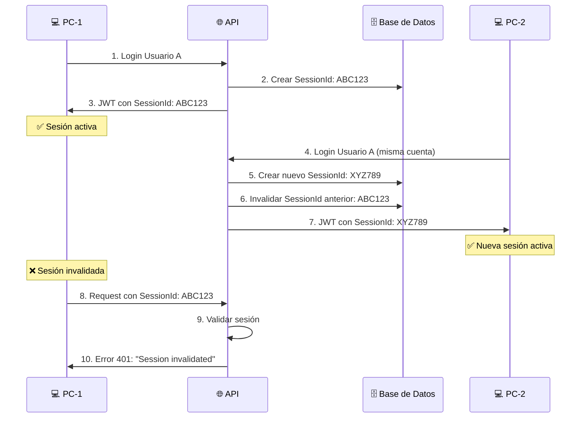

# 🔐 Sistema de Autenticación JWT con Sesión Única - .NET 9

## 📝 Descripción

Este proyecto implementa un **sistema completo de autenticación JWT** desarrollado en **.NET 9** que garantiza que **solo una máquina puede estar conectada por usuario a la vez**. Cuando un usuario inicia sesión desde un dispositivo diferente, la sesión anterior se invalida automáticamente.

## 🚀 Características Principales

### 🔑 Autenticación Avanzada
- **JWT Tokens**: Autenticación basada en JSON Web Tokens
- **Refresh Tokens**: Renovación segura de tokens de acceso
- **Sesión Única**: Solo una sesión activa por usuario
- **Invalidación Automática**: Nuevos logins desconectan sesiones anteriores
- **Seguimiento de IP**: Registra desde qué IP se conectó cada usuario

### 🛡️ Seguridad
- **Hash de Contraseñas**: Usando ASP.NET Core Identity PasswordHasher
- **Validación Estricta**: Verificación completa de tokens JWT
- **Middleware de Sesión**: Validación en tiempo real de sesiones activas
- **Roles y Permisos**: Sistema de autorización basado en roles

### 📱 Cliente de Pruebas
- **Aplicación de Consola**: Para probar todas las funcionalidades
- **Menú Interactivo**: Fácil navegación y testing
- **Información de Sesión**: Visualización de datos de la sesión actual

## 🏗️ Arquitectura del Proyecto

```
JwtAuth/
├── 📁 JWTAuth/                  # 🌐 API Principal
│   ├── Controllers/             # 🎮 Controladores REST
│   │   ├── AuthController.cs    # 🔐 Autenticación y autorización
│   │   └── SecureController.cs  # 🛡️ Endpoints protegidos
│   ├── Services/               # 💼 Lógica de negocio
│   │   ├── IAuthService.cs     # 📋 Interfaz del servicio
│   │   └── AuthService.cs      # 🔧 Implementación de autenticación
│   ├── Data/                   # 🗄️ Acceso a datos
│   │   └── UserDbContext.cs    # 📊 Contexto de Entity Framework
│   ├── Entities/               # 📦 Modelos de dominio
│   │   └── User.cs             # 👤 Entidad de usuario
│   ├── Models/                 # 📄 DTOs y modelos de transferencia
│   │   ├── UserDto.cs          # 👥 DTO de usuario
│   │   ├── TokenResponseDto.cs # 🎫 Respuesta de tokens
│   │   └── RefreshTokenRequestDto.cs # 🔄 Solicitud de refresh
│   ├── Middleware/             # ⚙️ Middleware personalizado
│   │   └── SessionValidationMiddleware.cs # ✅ Validación de sesiones
│   └── Migrations/             # 📈 Migraciones de base de datos
├── 📁 ConsolaJWT/              # 🖥️ Cliente de Pruebas
│   ├── Program.cs              # 🎯 Aplicación de consola interactiva
│   └── Models/                 # 📋 Modelos para el cliente
└── 📁 GeneradorHash/           # 🔐 Generador de Claves JWT
    ├── Program.cs              # 🎲 Aplicación generadora
    └── Helpers/
        └── JWTPrivateKeyGenerator.cs # 🗝️ Generador de claves seguras
```

## 🔧 Instalación y Configuración

### 📋 Prerequisitos

- **.NET 9 SDK** o superior
- **SQL Server** (LocalDB funciona perfectamente)
- **Entity Framework Core Tools**

### 🛠️ Pasos de Instalación

1. **Clonar el repositorio**
   ```bash
   git clone https://github.com/tu-usuario/jwt-auth-dotnet9.git
   cd jwt-auth-dotnet9
   ```

2. **Restaurar dependencias**
   ```bash
   dotnet restore Security.JWTAuth.sln
   ```

3. **Configurar la base de datos**
   ```bash
   cd JWTAuth
   dotnet ef database update
   ```

4. **Generar una clave JWT segura** *(Opcional pero recomendado)*
   ```bash
   cd ../GeneradorHash
   dotnet run
   # Ingresa un texto base para generar tu clave personalizada
   ```

5. **Configurar appsettings.json**
   ```json
   {
     "ConnectionStrings": {
       "UserDatabase": "Server=.;Database=UserDb;Trusted_Connection=true;TrustServerCertificate=true;"
     },
     "AppSettings": {
       "Token": "TU_CLAVE_JWT_GENERADA_AQUI",
       "Issuer": "TuAplicacion",
       "Audience": "TuAudiencia"
     }
   }
   ```

6. **Ejecutar la API**
   ```bash
   cd ../JWTAuth
   dotnet run
   ```

## 🌐 API Endpoints

### 🔐 Autenticación

| Método | Endpoint | Descripción | Autenticación |
|--------|----------|-------------|---------------|
| `POST` | `/api/auth/register` | 📝 Registrar nuevo usuario | ❌ No |
| `POST` | `/api/auth/login` | 🔑 Iniciar sesión | ❌ No |
| `POST` | `/api/auth/refresh-token` | 🔄 Renovar tokens | ❌ No |
| `POST` | `/api/auth/logout` | 🚪 Cerrar sesión | ✅ Sí |

### 📊 Información y Pruebas

| Método | Endpoint | Descripción | Autenticación |
|--------|----------|-------------|---------------|
| `GET` | `/api/auth/session-info` | 📋 Información de sesión actual | ✅ Sí |
| `GET` | `/api/auth` | 🧪 Endpoint protegido básico | ✅ Sí |
| `GET` | `/api/auth/admin-only` | 👑 Solo para administradores | ✅ Admin |
| `GET` | `/api/secure/test` | 🛡️ Endpoint protegido alternativo | ✅ Sí |

### 📥 Ejemplos de Requests

#### Registrar Usuario
```json
POST /api/auth/register
{
  "username": "usuario123",
  "password": "MiPassword123!"
}
```

#### Iniciar Sesión
```json
POST /api/auth/login
{
  "username": "usuario123",
  "password": "MiPassword123!"
}
```

#### Renovar Token
```json
POST /api/auth/refresh-token
{
  "userId": "guid-del-usuario",
  "refreshToken": "token-de-refresh"
}
```

## 🔒 Cómo Funciona la Sesión Única

### 🎯 Flujo de Invalidación Automática



### 🔍 Componentes Clave

1. **SessionId Único**: Cada login genera un identificador único
2. **Middleware de Validación**: Verifica en cada request si la sesión sigue activa
3. **Invalidación Automática**: Nuevos logins invalidan sesiones anteriores
4. **Seguimiento de IP**: Registra desde qué dirección IP se conectó

### 📊 Información de Sesión

El sistema rastrea:
- **SessionId**: Identificador único de la sesión
- **LastLoginTime**: Timestamp del último login
- **LastLoginIp**: Dirección IP del último acceso
- **RefreshToken**: Token para renovar la sesión
- **RefreshTokenExpiryTime**: Fecha de expiración del refresh token

## 🖥️ Cliente de Consola (ConsolaJWT)

### 🎮 Funcionalidades del Cliente

```
============================
 JWT DEMO – CONSOLA CLIENTE 
============================

Servidor: http://localhost:5000

MENÚ PRINCIPAL

1. Crear usuario
2. Login
3. Acceder a endpoint protegido
4. Ver información de sesión
5. Logout
0. Salir
```

### 🧪 Pruebas de Sesión Única

Para probar la funcionalidad de sesión única:

1. **Ejecutar dos instancias** del cliente de consola:
   ```bash
   # Terminal 1
   cd ConsolaJWT
   dotnet run
   
   # Terminal 2 (nueva ventana)
   cd ConsolaJWT
   dotnet run
   ```

2. **Crear un usuario** en cualquiera de las instancias

3. **Hacer login con el mismo usuario** en ambas instancias

4. **Observar el comportamiento**:
   - ✅ La segunda sesión funciona correctamente
   - ❌ La primera sesión recibe error "Session invalidated"

## 🔐 Generador de Claves JWT (GeneradorHash)

### 🎯 Propósito

El **GeneradorHash** es una utilidad que genera claves criptográficamente seguras para firmar tokens JWT usando el algoritmo **SHA-512**.

### 🚀 Uso

```bash
cd GeneradorHash
dotnet run
```

```
Ingrese el texto con el cual quiere armar el Hash: MiClaveSecreta123!
Presione una tecla

Su codigo Hash es: AQoB9GJ5gD9UJv9XGixVmFioOLU+SbqMLc1Das/sPUlTtLIfTh1Faun+etohSTUf4JgfWcsuTP8f69+dHcIR1A==
Presione una tecla para salir (previamente copie el hash)
```

### 🔧 Características

- **SHA-512**: Algoritmo criptográfico robusto
- **Base64**: Formato compatible con configuración .NET
- **512 bits**: Longitud de clave segura para HMAC-SHA512
- **Determinista**: El mismo texto siempre genera el mismo hash

### 📋 Recomendaciones

1. **Usa un texto único**: Combina palabras, números y símbolos
2. **Mantén seguro**: No compartas el texto base usado
3. **Guarda el hash**: Úsalo en tu `appsettings.json`
4. **Rotación**: Cambia la clave periódicamente en producción

## 🗄️ Base de Datos

### 📊 Esquema de la Tabla Users

```sql
CREATE TABLE Users (
    Id UNIQUEIDENTIFIER PRIMARY KEY DEFAULT NEWID(),
    Username NVARCHAR(MAX) NOT NULL,
    PasswordHash NVARCHAR(MAX) NOT NULL,
    Role NVARCHAR(MAX) NOT NULL DEFAULT 'User',
    RefreshToken NVARCHAR(MAX) NULL,
    RefreshTokenExpiryTime DATETIME2 NULL,
    SessionId NVARCHAR(MAX) NULL,
    LastLoginTime DATETIME2 NULL,
    LastLoginIp NVARCHAR(MAX) NULL
);
```

### 🔄 Migraciones

```bash
# Crear nueva migración
dotnet ef migrations add "NombreDeLaMigracion"

# Aplicar migraciones
dotnet ef database update

# Revertir migración
dotnet ef database update MigracionAnterior

# Eliminar base de datos
dotnet ef database drop
```

## ⚙️ Configuración Avanzada

### 🕐 Duración de Tokens

En `AuthService.cs`, línea 117:
```csharp
expires: DateTime.UtcNow.AddMinutes(15), // Cambiar de 1 a 15 minutos
```

### 🌐 Puerto del Servidor

En `Program.cs`, línea 23:
```csharp
options.ListenAnyIP(8080); // Cambiar puerto
```

### 🔄 Duración del Refresh Token

En `AuthService.cs`, línea 94:
```csharp
user.RefreshTokenExpiryTime = DateTime.UtcNow.AddDays(30); // Cambiar de 7 a 30 días
```

## 🛡️ Consideraciones de Seguridad

### ✅ Implementadas

- **Sesión única por usuario**
- **Hash seguro de contraseñas** (bcrypt via PasswordHasher)
- **Validación estricta de tokens** (ClockSkew = 0)
- **Seguimiento de IP** de login
- **Invalidación automática** de sesiones
- **Refresh tokens** con expiración

### ⚠️ Recomendaciones para Producción

1. **Variables de Entorno**: Mover claves JWT a variables de entorno
2. **HTTPS**: Siempre usar HTTPS en producción
3. **Rate Limiting**: Implementar límites de intentos de login
4. **Logging**: Agregar logs de auditoría de seguridad
5. **Monitoreo**: Implementar alertas de seguridad
6. **Validación de Input**: Validar y sanitizar todas las entradas

### 🔐 Variables de Entorno Recomendadas

```bash
# Linux/Mac
export JWT_SECRET="tu-clave-jwt-super-segura"
export CONNECTION_STRING="tu-string-de-conexion"

# Windows
set JWT_SECRET=tu-clave-jwt-super-segura
set CONNECTION_STRING=tu-string-de-conexion
```

## 🚨 Troubleshooting

### ❌ Errores Comunes

#### "Session invalidated. Please login again."
- **Causa**: Otro dispositivo se logueó con la misma cuenta
- **Solución**: Hacer login nuevamente

#### "Invalid username or password."
- **Causa**: Credenciales incorrectas
- **Solución**: Verificar usuario y contraseña

#### "Invalid refresh token."
- **Causa**: Token expirado o sesión invalidada
- **Solución**: Hacer login completo

#### Error de conexión a base de datos
- **Causa**: SQL Server no está ejecutándose
- **Solución**: 
  ```bash
  # Verificar que SQL Server esté activo
  # Ejecutar migración
  dotnet ef database update
  ```

### 🔧 Comandos de Diagnóstico

```bash
# Verificar compilación
dotnet build Security.JWTAuth.sln

# Verificar estado de Entity Framework
dotnet ef dbcontext info

# Verificar migraciones pendientes
dotnet ef migrations list

# Verificar conexión
dotnet ef database drop
dotnet ef database update
```

## 📈 Roadmap y Mejoras Futuras

### 🎯 Próximas Funcionalidades

- [ ] **Rate Limiting**: Límites de intentos de login
- [ ] **Audit Logging**: Logs completos de auditoría
- [ ] **Multi-Factor Authentication**: 2FA/MFA
- [ ] **OAuth2 Integration**: Login con Google, Microsoft, etc.
- [ ] **Token Blacklisting**: Invalidación manual de tokens
- [ ] **API Versioning**: Versionado de API
- [ ] **Health Checks**: Endpoints de salud
- [ ] **Metrics**: Métricas de Prometheus
- [ ] **Docker Support**: Containerización
- [ ] **Unit Tests**: Cobertura completa de tests

### 🔧 Mejoras Técnicas

- [ ] **Cache**: Implementar cache de sesiones
- [ ] **Background Services**: Limpieza automática de tokens expirados
- [ ] **SignalR**: Notificaciones en tiempo real de logout
- [ ] **gRPC**: Servicios de alta performance
- [ ] **GraphQL**: API alternativa
- [ ] **Swagger**: Documentación interactiva

## 🤝 Contribuciones

¡Las contribuciones son bienvenidas! Por favor:

1. Fork el proyecto
2. Crea una rama para tu feature (`git checkout -b feature/nueva-funcionalidad`)
3. Commit tus cambios (`git commit -m 'Agregar nueva funcionalidad'`)
4. Push a la rama (`git push origin feature/nueva-funcionalidad`)
5. Abre un Pull Request

## 📞 Soporte

- **Issues**: [GitHub Issues](https://github.com/tu-usuario/jwt-auth-dotnet9/issues)
- **Discussions**: [GitHub Discussions](https://github.com/tu-usuario/jwt-auth-dotnet9/discussions)
- **Email**: tu-email@ejemplo.com

## 📄 Licencia

Este proyecto está bajo la Licencia MIT. Ver el archivo [LICENSE](LICENSE) para más detalles.

## 🙏 Agradecimientos

- **Microsoft**: Por .NET 9 y Entity Framework Core
- **JWT.io**: Por la excelente documentación de JWT
- **Comunidad .NET**: Por las mejores prácticas y guías

---

**⭐ Si este proyecto te resulta útil, ¡considera darle una estrella en GitHub!**

*Desarrollado con ❤️ para la comunidad .NET*